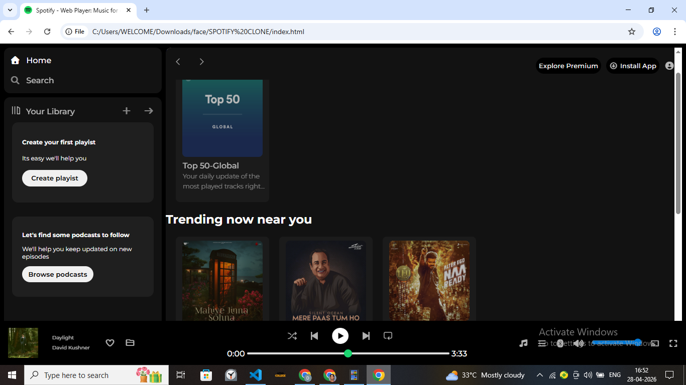

# 🎧 Spotify Clone (Frontend)

A simple **Spotify Web Player UI clone** built using **HTML & CSS**.
This project replicates the look and feel of Spotify's web interface, including sidebar navigation, music cards, and a player layout.

---

## 🚀 Features

* 🎵 Sidebar with Home, Search, and Library
* 📂 Playlist & Podcast sections
* 🧭 Navigation bar with controls
* 🎶 Music cards (Recently Played, Trending, Featured)
* ▶️ Music player UI with controls
* 📱 Responsive layout (basic)

---

## 🛠️ Tech Stack

* HTML5
* CSS3
* Font Awesome (icons)
* Google Fonts (Montserrat)

---

## 📁 Project Structure

```
Spotify-Clone/
│
├── index.html
├── style.css
├── assets/
│   ├── images, icons, logos
```

---

## 💻 How to Run

1. Clone the repository:

   ```bash
   git clone https://github.com/DharshiniMR/SPOTIFY-CLONE.git
   ```

2. Open the project folder

3. Run `index.html` in your browser

---

## 📸 Preview

## 📸 Preview


---

## ⚠️ Note

* This is a **frontend-only project**
* No backend or real music functionality is implemented
* Built for learning and UI practice

---

## 🌱 Future Improvements

* Add JavaScript for interactivity
* Integrate real music APIs
* Improve responsiveness
* Add authentication (login/signup)

---

## 🙌 Acknowledgement

Inspired by Spotify UI for educational purposes.

---

## ⭐ If you like this project

Give it a ⭐ on GitHub!

---
